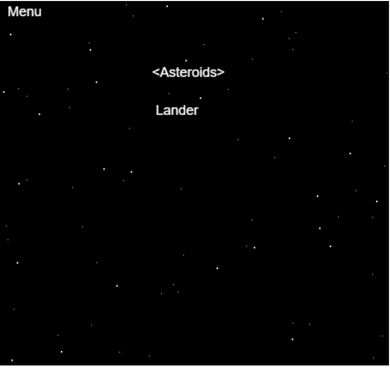
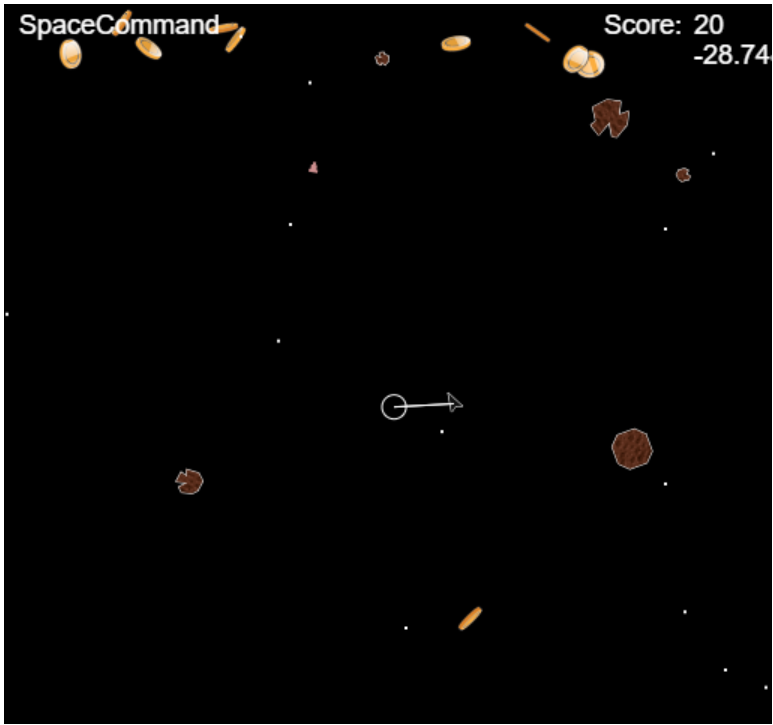
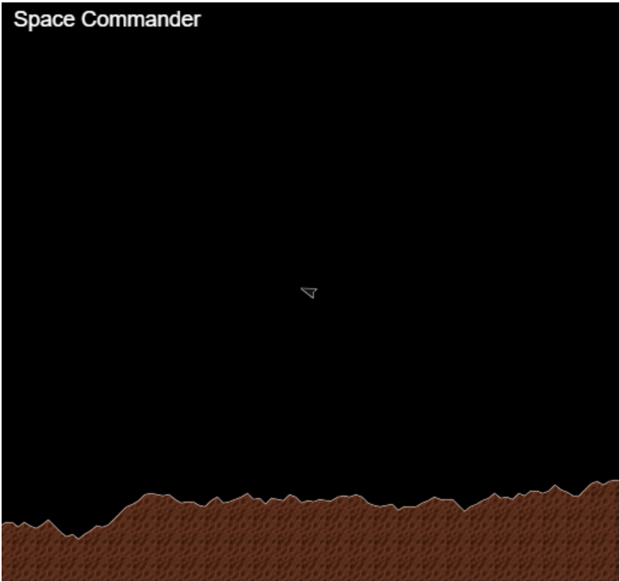

#  SpaceCommand
The start of a two dimensional, strategic highly playable, space adventure game involving asteroids, space combat, planetry landings, planetry combat. 

Initial Starting point is Asteroids and Lander Game

Player starts with small ship, building a fleet, where each ship can be controlled directly or commanded with high level commands
and upgrade.

One player campaign against AI component in galaxy or multiplayer by server.

Game moves between different states: space, planet landing, planet surface.

Ships:
Each has own characteristic, weapons (lasers, phasers, bullets, missiles), defense (shields, tractor beams)

Planets:
Build mines, factories, make weapons, ships, defenses.

Eventually to involve trade, inter solar system exploration, mining.

Written in Typescript, using visual Studio Code and using Requirejs to load exported Modules.

Dependencies:
npm install requirejs

Todo

Unit tests
gravity
sound
weapons
defence

